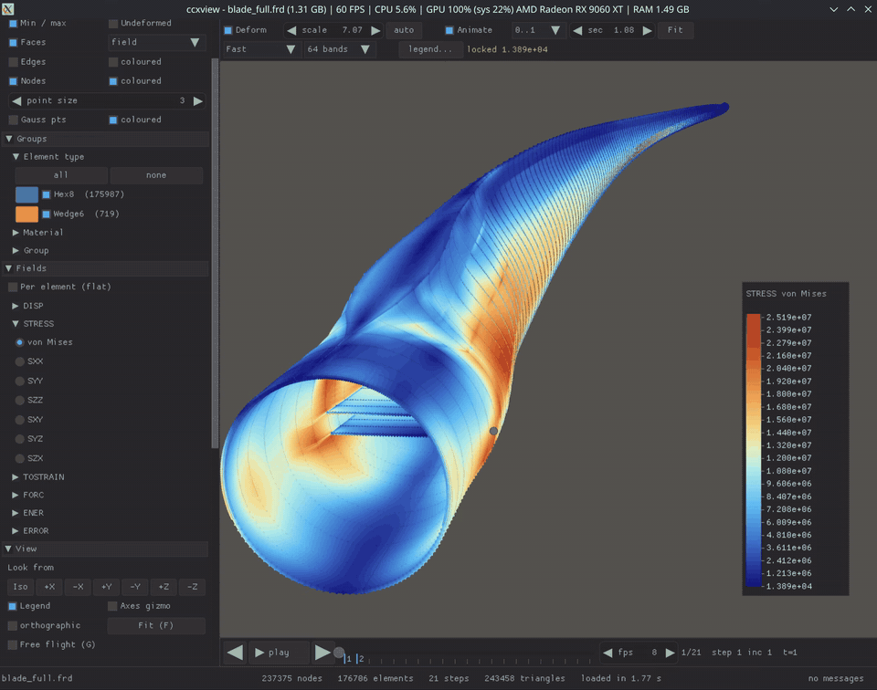

# ccxview

A fast viewer for CalculiX results and models: `.frd`, `.inp`, `.dat`, and cgx
`.fbd`. Plain C99, one executable, no installation.



## Try it

**In the browser, nothing to install:** https://basemrajjoub.github.io/ccxview/
(WebGL2; the showcase model is preloaded, Open... or drag and drop your own
files, exports come as downloads).

Ready-made builds are in [binaries/](binaries/):

- **Linux**: `binaries/linux/ccxview` (glibc 2.34 or newer: Ubuntu 22.04,
  Debian 12, Fedora 35, RHEL 9 and later). Double-click it or run it from a
  terminal. Keep the `lib/` folder next to it.
- **Windows**: `binaries/windows/ccxview.exe` (Windows 10/11, no DLLs needed).
- **Browser**: `binaries/web/ccxview.html`, the same page as the link above,
  works opened from disk.

## What it does

- **Fast.** Five million elements load in about a second; the view stays
  smooth on large models. Fields are decoded only when shown.
- **Renders on the GPU, or without one.** OpenGL 4.1 when a driver exists,
  otherwise ccxview restarts itself on Mesa's software renderer. The browser
  build runs on WebGL2.
- **Most CalculiX elements.** Hex, tet, wedge, shells, plane and axisymmetric
  elements, beams, trusses, springs, dashpots, masses, gaps, rigid bodies,
  couplings, ties and contact are read and drawn.
- **Fields on nodes, edges, faces, and Gauss points.** Any result component as
  colour on faces, edges or nodes; per-element (flat) colouring; vectors as
  arrows. Gauss points are drawn as balls at the integration points, coloured
  by the field, or by the exact values from a `.dat` file.
- **Decks too.** Open a `.inp` on its own: mesh, sets, surfaces, materials,
  supports and loads. With the `.frd` beside it, both are shown.
- **Animation.** Mode shapes, steady-state phases, deformation cycles, step
  playback. Undeformed ghost, min/max markers, probe, find by id, path plots,
  compare two runs (A minus B), clip plane, crop box, mirror symmetry,
  convergence plot from `.sta`/`.cvg`.
- **Export.** PNG of the view, MP4 video or PNG sequence of a deformation
  cycle or of every step, CSV, VTK for ParaView, and a view file to reproduce
  a picture later. All available from the command line for scripting.
- **Robust.** Damaged records are skipped and listed, never a crash. Settings,
  window size and recent files are remembered.

## Use

```sh
ccxview model.frd
ccxview model.frd --shot out.png            # render, save, quit
ccxview model.frd --export mp4              # animation video
ccxview model.frd --field DISP --vectors    # displacement arrows
ccxview model.frd --gp                      # Gauss points
ccxview run2.frd --compare run1.frd         # difference of two runs
ccxview model.frd --software                # CPU rendering
ccxview --check model.frd                   # headless parse for CI
```

Or Open... (Ctrl+O), drop a file on the window, or type a path in the box.

| Input | Action |
|---|---|
| left drag / right drag / wheel | orbit / pan / zoom (about the point under the cursor; View panel: up axis Y or Z, cursor pivot on/off) |
| click / double-click | probe / zoom to element |
| F, R, 1..6 | fit, reset, look from ±X ±Y ±Z |
| space, ← → | play, step |
| G | free flight (WASD, Esc to leave) |
| H | view only, for screenshots |
| right-click legend | legend settings |
| Ctrl+O / Ctrl+E / Ctrl+F | open / export PNG / find |

## Build

```sh
make                 # Linux/macOS -> build/ccxview
make PORTABLE=1      # Linux build for glibc >= 2.34
make win             # Windows exe with mingw-w64 -> build/win/ccxview.exe
make wasm            # browser build with Emscripten -> docs/index.html
build.bat            # Windows with MSVC (no console window; "build.bat console" for one)
make test            # unit tests
scripts/pack-binaries.sh   # refresh binaries/
```

Dependencies: a C compiler and, on Linux, X11 and OpenGL development headers.
Everything else is vendored (sokol, Nuklear, stb, minih264e, minimp4,
tinyfiledialogs).

`samples/showcase/` holds one small solved deck with every element type and
feature. Design notes in [docs/spec.md](docs/spec.md).

License: GPL-2.0-or-later, the same as CalculiX. Vendored libraries keep
their own licences (zlib, MIT, public domain), see [vendor/README.md](vendor/README.md).
